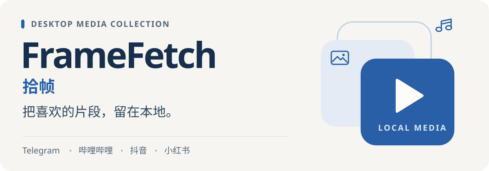

<p align="center">
  
</p>

<p align="center">
  <strong>一个桌面窗口，管理多个平台的媒体下载。</strong><br>
  视频、图片、封面与音频，保存到本地，按平台和作品整理。
</p>

<p align="center">
  <a href="#开始使用">开始使用</a> ·
  <a href="#平台能力">平台能力</a> ·
  <a href="https://github.com/HoshiSaneko/framefetch/issues">反馈问题</a> ·
  <a href="https://github.com/HoshiSaneko">作者 Saneko</a>
</p>

<p align="center">Windows · Material Design 3 · Tauri + Rust + React · MIT</p>


<p align="center"><sub>实际界面，演示数据。截图中的文件、速度与进度仅用于展示，不代表性能测试。</sub></p>

## 下载之后，也好找到

FrameFetch（拾帧）是一款桌面媒体下载与整理工具。粘贴链接、选择内容、加入队列，在同一个窗口查看进度，再从本地打开文件。

- **任务放在一起看。** 按平台、状态或文件名筛选，快速找到进行中、暂停和需要处理的任务。
- **内容按需要保存。** 支持的平台可选择视频清晰度、封面、音频或图集内容，具体能力见下表。
- **文件按作品整理。** 下载内容按平台和作品归档，支持本地图片、视频预览和打开所在文件夹。
- **删除由你决定。** 移除记录与删除本地文件分开选择，登录会话和下载记录保存在本机。

## 平台能力

| 平台 | 可以做什么 |
| --- | --- |
| **Telegram** | 消息链接下载、批量添加、暂停与断点续传 |
| **哔哩哔哩** | 选择视频清晰度，下载视频、封面或音频 |
| **抖音** | 作品下载，以及收藏、合集等批量任务 |
| **小红书** | 视频、封面、音频下载与图集勾选 |

<details>
<summary>查看平台连接界面</summary>


实际界面的开发预览，未连接真实账号。需要登录的平台可在这里完成连接。

</details>

## 开始使用

当前提供 **Windows 源码运行与打包流程**。先准备 Node.js、Rust、Windows C++ Build Tools 和 WebView2，再在 PowerShell 中执行：

```powershell
git clone https://github.com/HoshiSaneko/framefetch.git
cd framefetch
npm ci
```

**准备下载组件。** 将 FFmpeg 与 FFprobe 放在同一个目录，然后执行下面的脚本。请把示例路径替换为自己的实际目录：

```powershell
./scripts/prepare-bilibili.ps1 -FFmpegDirectory "C:/tools/ffmpeg/bin"
```

脚本下载并校验 yt-dlp，并将 FFmpeg、FFprobe 复制到 `src-tauri/bin/`。这些可执行文件不纳入 Git；部分下载、音频提取和封装功能依赖它们。组件信息见 [下载组件说明](src-tauri/bin/README.txt)。

**启动桌面应用：**

```powershell
npm run desktop
```

1. 在「平台连接」中连接需要登录的平台。Telegram 默认内置 API 配置，直接扫码即可。
2. 点击「新建下载」或按 `Ctrl + N`，粘贴链接并选择需要保存的内容。
3. 加入队列，查看进度；完成后打开文件或所在文件夹。

默认文件保存到程序所在目录的 `downloads` 文件夹。

### 先看看界面

```powershell
npm run dev
```

打开 [本地界面预览](http://127.0.0.1:1420/)。需要示例任务时，使用 [演示预览](http://127.0.0.1:1420/?design-preview)。浏览器预览仅展示界面，实际登录与下载请使用桌面版。

## 使用边界

- 下载结果取决于平台接口、账号权限、内容状态和网络条件；部分功能需要登录。
- Telegram 处理指定消息链接，私密频道需当前账号已加入；不支持保存阅后即焚媒体。
- 可选清晰度与媒体类型以实际解析结果为准，不保证每条链接都提供全部选项。
- 当前开发与打包流程面向 Windows，尚未声明 macOS 或 Linux 可用。

<details>
<summary>开发、测试与打包</summary>

### 验证

```powershell
npm test -- --maxWorkers=2
npm run build
cargo test --manifest-path src-tauri/Cargo.toml --lib
```

### 打包

准备好下载组件后执行：

```powershell
npm run tauri -- build
```

便携分发时，请保留程序旁的 `bin` 文件夹，以及对应组件的许可证与构建说明。

### 目录

| 路径 | 内容 |
| --- | --- |
| `src/` | React 界面、交互和前端测试 |
| `src-tauri/src/` | 平台连接、下载调度与本地存储 |
| `src-tauri/bin/` | 第三方下载组件及说明 |
| `public-brand/` | 应用与平台图标 |
| `scripts/` | 组件准备与图标生成工具 |

仓库中的 `src-tauri/telegram-app.json` 在编译时嵌入程序，无需额外填写。若需要自己的 API，可参考 `src-tauri/telegram-app.example.json` 修改。账号会话与下载记录仍只保存在本机。

</details>

## 开源与致谢

FrameFetch 使用 React、Tauri、grammers、Lucide、yt-dlp 和 FFmpeg 等开源组件。项目采用 [MIT License](LICENSE)；第三方组件保留各自的许可，平台标识归各自权利人所有。

---

由 [Saneko](https://github.com/HoshiSaneko) 开发 · [项目主页](https://github.com/HoshiSaneko/framefetch) · [报告问题或建议](https://github.com/HoshiSaneko/framefetch/issues)
