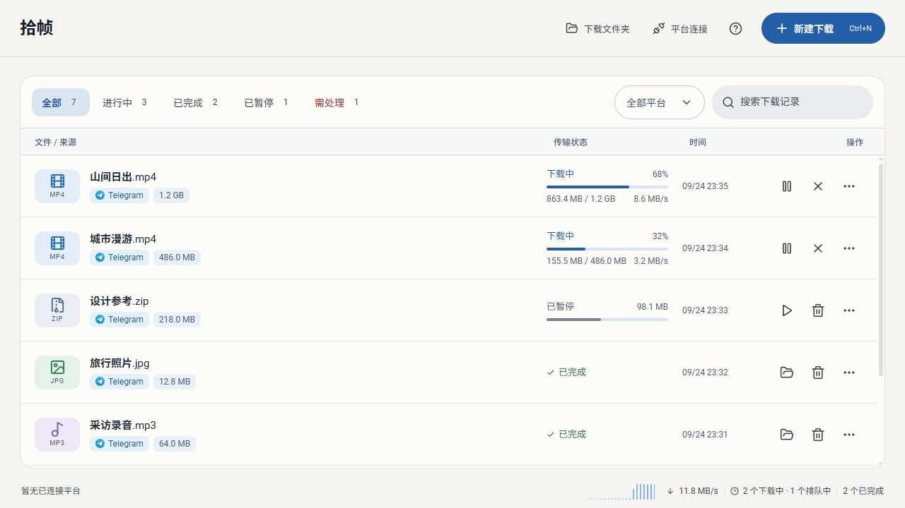
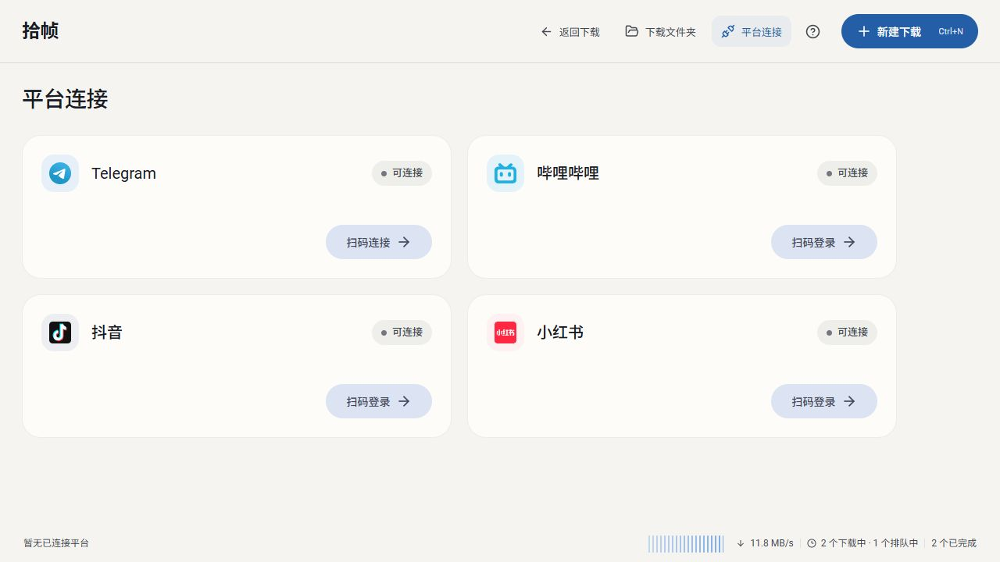

<h1 align="center">FrameFetch · 拾帧</h1>

<p align="center">
  <strong>为自己的作品与获授权的素材，留一份有序的本地存档。</strong><br>
  面向个人媒体归档、创作者素材备份及技术研究的桌面工具。
</p>

<p align="center">Windows / macOS · Tauri + Rust + React · MIT</p>

<p align="center">
  <a href="#功能概览">功能概览</a> ·
  <a href="#开始使用">开始使用</a> ·
  <a href="#使用约定">使用约定</a> ·
  <a href="https://github.com/HoshiSaneko/framefetch/issues">反馈问题</a>
</p>

FrameFetch（拾帧）将媒体保存、任务管理和本地整理放在同一个桌面窗口中。你可以通过受支持的内容链接，为自己的作品或已获授权的素材建立本地副本，并按来源与作品整理视频、图片、封面和音频。

> 本项目仅用于个人媒体归档、创作者素材备份及技术研究。用户应仅下载自己拥有合法权利或已获得授权的内容，并自行遵守相关法律法规及第三方平台服务协议。



<p align="center"><sub>截图使用演示数据，其中的文件、速度与进度仅用于界面展示，不代表性能测试。</sub></p>

## 功能概览

- **统一管理任务。** 查看队列与传输进度，按来源、状态或文件名筛选记录。
- **选择所需素材。** 根据内容实际提供的选项，保存视频、图片、封面或音频。
- **按作品整理文件。** 将素材归入对应目录，支持本地图片、视频预览及打开所在文件夹。
- **保留清晰的操作边界。** 移除记录与删除本地文件分开确认，登录会话和任务记录保存在本机。

<details>
<summary>支持的内容来源与能力</summary>

以下为技术兼容范围，使用时仍需确认内容权利与平台规则。能够访问或解析内容，不代表已经获得下载、复制或再分发授权。

| 内容来源 | 当前能力 |
| --- | --- |
| Telegram | 指定消息链接、批量添加、暂停与断点续传 |
| 哔哩哔哩 | 视频清晰度选择，以及视频、封面或音频保存 |
| 抖音 | 作品保存，以及收藏、合集等批量任务 |
| 小红书 | 视频、封面、音频保存与图集选择 |

部分功能需要连接账号。私密 Telegram 频道要求当前账号已加入；不支持保存阅后即焚媒体。可用清晰度、媒体类型与任务结果取决于来源接口、账号权限、内容状态及网络条件。



</details>

## 开始使用

当前以源码运行与本机构建为主。请先安装 Node.js、npm、Rust，以及对应系统的构建工具，再获取项目：

```bash
git clone https://github.com/HoshiSaneko/framefetch.git
cd framefetch
npm ci
```

### Windows

准备 Windows C++ Build Tools 和 WebView2。将 FFmpeg 与 FFprobe 放在同一目录，然后在项目根目录的 PowerShell 中执行：

```powershell
./scripts/prepare-bilibili.ps1 -FFmpegDirectory "C:/tools/ffmpeg/bin"
npm run desktop
```

请将示例路径替换为实际目录。脚本会下载并校验 yt-dlp，再复制 FFmpeg 与 FFprobe。虽然脚本名称包含 `bilibili`，准备的组件也供其他相关媒体处理功能使用。

### macOS

要求 **macOS 14 或更高版本**，并安装 Xcode Command Line Tools。此版本要求用于各内容来源的独立 WebKit 登录会话存储。

在项目根目录执行：

```bash
bash scripts/prepare-macos.sh
npm run desktop
```

脚本根据本机架构准备 macOS 版 yt-dlp、FFmpeg 与 FFprobe，并校验下载文件。FFmpeg 静态构建来自 [OSXExperts](https://www.osxexperts.net/)。应用优先使用随包组件，也可查找 Homebrew 常见安装目录及 `PATH` 中的组件。

Apple Silicon 已完成本机编译、测试和启动验证；Intel 准备脚本已提供，尚未在 Intel 设备上验证。请在目标架构的 Mac 上准备组件和构建应用。

若 Rust 安装在项目的 `.tools/cargo` 与 `.tools/rustup` 中，启动脚本会自动使用该工具链。常规 Rust 安装可直接通过 `PATH` 使用。

### 保存第一份素材

1. 确认内容属于自己，或已获得相应授权；按需在「平台连接」中连接账号。
2. 点击「新建下载」，粘贴内容链接并选择所需素材。Windows 快捷键为 `Ctrl+N`，macOS 为 `⌘N`。
3. 加入队列，查看任务进度；完成后在本地预览或打开所在文件夹。

| 系统 | 默认保存位置 |
| --- | --- |
| Windows | 程序所在目录的 `downloads` 文件夹 |
| macOS | `~/Downloads/FrameFetch` |

第三方组件的可执行文件不纳入 Git，部分媒体保存、音频提取和封装功能依赖这些组件。详细信息见 [组件说明](src-tauri/bin/README.txt)。

### 界面预览

```bash
npm run dev
```

打开 [本地预览](http://127.0.0.1:1420/) 或带示例任务的 [演示预览](http://127.0.0.1:1420/?design-preview)。浏览器预览用于查看界面，实际账号连接与媒体保存需要桌面版。

## 使用约定

- **确认内容权利。** 仅处理自己拥有合法权利或已获授权的内容；公开可访问、个人使用或技术研究本身不等于获得授权。
- **遵守来源规则。** 使用时应遵守适用法律法规及第三方平台服务协议，尊重访问限制、账号权限与内容保护措施。
- **尊重隐私与作品权益。** 不将本工具用于未经授权的收集、传播、商业利用或其他侵害他人权益的行为。
- **区分软件与内容许可。** 本项目的 MIT 许可证仅适用于项目代码，不授予任何第三方媒体内容的使用权。

本项目为独立开源工具，与所列第三方平台不存在官方关联、授权或背书关系。平台名称及标识仅用于说明兼容范围，相关权利归各自权利人所有。

## 开发与构建

React 负责界面，Tauri 提供桌面容器与系统交互，Rust 负责后台任务及本地存储。

### 验证

```bash
npm test -- --maxWorkers=2
npm run build
cargo test --manifest-path src-tauri/Cargo.toml --lib
```

最后一条命令需要 `cargo` 已加入当前终端的 `PATH`。平台账号连接与真实内容保存还需结合实际授权账号和素材进行验证；Linux 尚未验证。

### 打包

先在目标系统上准备媒体组件，再执行：

```bash
npm run desktop:bundle
```

产物位于 `src-tauri/target/release/bundle/`：Windows 生成 NSIS 安装包，macOS 生成 `.app` 和 `.dmg`。macOS 构建尚未配置 Apple Developer 分发签名与公证。

仅编译可执行文件可使用 `npm run desktop:build`。Windows 便携分发需保留程序旁的 `bin` 文件夹；macOS 应保留完整 `.app` 包内的资源。分发第三方组件时，应一并保留对应许可证与构建说明。

### 项目结构

| 路径 | 内容 |
| --- | --- |
| `src/` | React 界面、交互和前端测试 |
| `src-tauri/src/` | 内容来源接入、任务调度与本地存储 |
| `src-tauri/bin/` | 第三方媒体组件及说明 |
| `public-brand/` | 应用与内容来源图标 |
| `scripts/` | 组件准备、桌面启动与图标生成工具 |

`src-tauri/telegram-app.json` 在编译时嵌入应用。需要使用自己的 Telegram API 配置时，可参考 `src-tauri/telegram-app.example.json`。账号会话与任务记录保存在本机。

## 许可证

FrameFetch 采用 [MIT License](LICENSE)，第三方组件遵循各自许可证。

---

由 [Saneko](https://github.com/HoshiSaneko) 开发 · [项目主页](https://github.com/HoshiSaneko/framefetch) · [报告问题或建议](https://github.com/HoshiSaneko/framefetch/issues)
